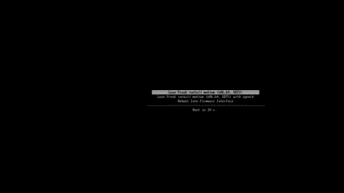

# LeanFreak
LFOS (LeanFreak Operating System)

<p align="center">
  
</p>

## TODO_Baseline_Setup
- [x] Baseline working image
- [x] Reword/Move/Add Misc items

## TODO_Baseline_Install_Script
- [ ] Review Archinstall
- [x] Hostname change - cycle through
- [ ] MAC Address - Avoid VM detection
- [ ] dhclient.conf - Vendor Class Identifier (often includes "Debian", or even "Kali")
- [ ] DNS queries - /etc/resolv.conf - /etc/hosts
- [ ] TCP/IP Stack Fingerprinting sysctl - Change TTL to match windows
- [ ] Link Repo's, dont install ALL tools - not "kali bloat OS"

## TODO_TBD
- [ ] avahi-daemon
- [ ] Services, like Samba is a giveaway
- [ ] Kernel metadata
- [ ] NTP - dont point to linux
- [ ] Integrity checksum core install

_Might move TODO_TBD to LFOS-packages._

<p align="center">
  
</p>

---

## Package Repository

[LFOS-packages](https://github.com/A3-N/LFOS-packages).

---

# TRCH - baseline

## ISO Creation
- airootfs/etc/mkinitcpio.conf.d\archiso.conf - Compression Changed for faster boot on ISO
- profiledef.sh - Compression Changed for faster boot on ISO 
- airootfs/etc/modprobe.d/broadcom-wl.conf - Added broadcom-wl package for specific Broadcom chipsets that either don’t work at all with open-source drivers Or work like dog (unstable, flaky connections)

## BIOS & UEFI
- syslinux/ - added more to this like memtest86+, hdt, Existing/Reboot/Poweroff.
- syslinux/ - supports BIOS El Torito and BIOS Legacy (MBR).
- Removed Support for UEFI 32-bit.
- efiboot/ && grub/ - Added UEFI support with grub. (In the future I would like to remove syslinux for full grub, but GRUB BIOS boot modes are a pain.) 

## Networking
- Added networkd to ISO boot and stub resolver.
- Added wireless capabilities. 
- - Additional configs for wwan and wlan

## Symlinks and systemd
- Realised my symlinks keep breaking?
- - resolv.conf
- - localtime
- - systemd
- - - networkd
- - - resolved
- - - iwd


```sh
rm -f airootfs/etc/resolv.conf
ln -sf /run/systemd/resolve/stub-resolv.conf airootfs/etc/resolv.conf
ln -sf /usr/share/zoneinfo/UTC airootfs/etc/localtime

rm airootfs/etc/systemd/system/multi-user.target.wants/systemd-networkd.service
ln -s /usr/lib/systemd/system/systemd-networkd.service airootfs/etc/systemd/system/multi-user.target.wants/systemd-networkd.service

rm airootfs/etc/systemd/system/multi-user.target.wants/systemd-resolved.service
ln -s /usr/lib/systemd/system/systemd-resolved.service airootfs/etc/systemd/system/multi-user.target.wants/systemd-resolved.service

ln -s /usr/lib/systemd/system/iwd.service airootfs/etc/systemd/system/multi-user.target.wants/iwd.service
```

## Install
- Direct boot to TTY1/autologin
- Small custom-pretty-ness
- Added custom repo for install script
